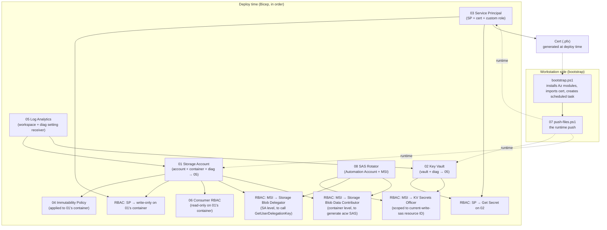

# Component Map

How the eight Atomic Legos compose. Each box is one directory under `components/`. Each arrow is a *deployment-time output → input* dependency, except where labeled *runtime*.

## Deployment-time dependency order

The order matters. The deploy script enforces it:

1. **05 Log Analytics first.** Everything else points its diagnostic settings here. If LA is not up first, downstream diag settings 400-error.
2. **01 Storage Account.** Depends on LA for diag setting target.
3. **04 Immutability Policy.** Applied to the container *after* the container exists. Bicep handles this with `dependsOn`, but it's worth naming.
4. **02 Key Vault.** Depends on LA. Independent of Storage; could be deployed in parallel.
5. **03 Service Principal + Cert.** Independent of all of the above on the resource side, but its RBAC assignments depend on SA and KV existing.
6. **RBAC assignments.** SP → write-only on container, SP → Get Secret on KV.
7. **06 Consumer RBAC.** SA → read-only for the named consumer security group.
8. **08 SAS Rotator (Automation Account).** Bicep creates the Automation Account and RBAC assignments. `Deploy.ps1` then uploads the runbook content and links the 6-day schedule via REST API (two `az automation` CLI verbs don't exist; Bicep alone cannot upload runbook content).
9. **Initial SAS generation.** Deploy script writes the first SAS into the Key Vault secret slot so the system works on day one. Subsequent rotation is handled automatically by component 08 every 6 days.

## Runtime composition

Once deployed, the workstation push (component 07) at every scheduled run:

1. Authenticates as the SP using the local cert (→ Entra ID, component 03)
2. Calls Key Vault Get Secret (→ component 02)
3. Receives the day's SAS
4. Writes new files to the container using the SAS (→ component 01)
5. Logs to local file *and* writes a structured audit line that storage logging captures (→ component 05)

## What can be deployed independently for testing

- **05 (LA)** — yes, standalone
- **01 (SA)** — yes, with a placeholder LA workspace ID
- **04 (Immutability)** — needs 01 first
- **02 (KV)** — yes, standalone
- **03 (SP)** — yes, standalone (RBAC assignments are separate Bicep modules)
- **06 (Consumer RBAC)** — needs 01
- **07 (Workstation)** — needs 03's cert, 01's account name, 02's vault URL
- **08 (SAS Rotator)** — needs 01 (storage account name), 02 (KV name + secret resource ID), 05 (LA workspace ID)

The ability to deploy each in isolation is what makes Stage 4 implementation tractable and Stage 6 troubleshooting tractable.
