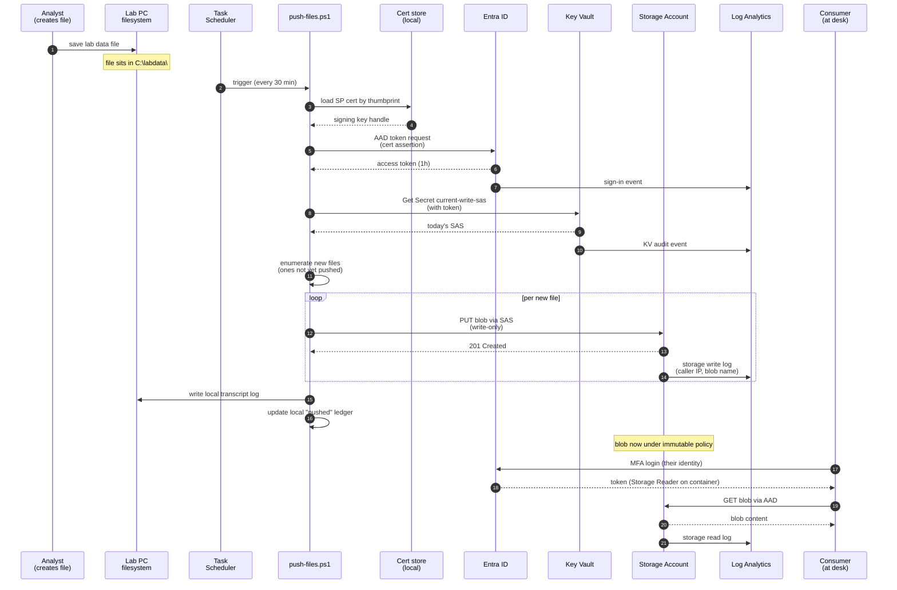

# Data Flow

Sequence diagram following one file from analyst's "save" on the lab PC to consumer's "read" from their desk.

## Step notes

- **Step 4 (cert load):** The cert is identified by thumbprint, not by friendly name. The bootstrap captures the thumbprint at install time and writes it into the script's config (`workstation/config.json`).
- **Step 6 (token request):** This uses the Microsoft Authentication Library (MSAL) under `Az.Accounts`. The cert's private key never leaves the cert store; the assertion is signed in-place.
- **Step 9 (Get Secret):** The token from step 6 is validated against the SP's RBAC on the Key Vault. The SP has only `Get Secret` (Key Vault data plane RBAC, not access policy mode).
- **Step 12 (enumerate new files):** The script keeps a local ledger of (file path, sha256, push timestamp) so it does not re-upload unchanged files. The ledger lives in the same scoped service-account profile as the cert.
- **Step 14 (PUT blob):** The blob name encodes `<workstation-hostname>/<YYYY-MM-DD>/<original-filename>` so consumers and operators can tell which workstation a file came from and when it landed.
- **Step 16 (storage log):** Each PUT generates a `StorageWrite` log event in LA, including caller principal ID, source IP, blob name, and result code.
- **Step 18 (local log):** A `Start-Transcript`-rotated log lives at `C:\ProgramData\AwacsBackup\logs\push-YYYY-MM-DD.log`, with a 14-day rotation.

## Logging output per push

A successful push of N new files produces, at minimum:

- 1 Entra sign-in event
- 1 Key Vault audit event (Get Secret)
- N storage write events (one per blob)
- 1 local PowerShell transcript with structured `[INFO]` / `[WARN]` / `[ERROR]` lines per file

A failed push produces, at minimum:

- 1 Entra sign-in event (success or failure)
- (depending on failure point) 0–N storage write events
- 1 local PowerShell transcript with `[ERROR]` line and stack trace
- 1 local "exit code != 0" recorded by the scheduled task History

## Consumer access pattern

Consumers do *not* run a script. They open Storage Explorer, Azure Portal, or use `azcopy` with their own AAD identity. RBAC scopes them to read on the container. They cannot delete, even if a typo in the deploy granted them too much, because immutability blocks delete at the storage layer.

## Cross-Agent Review

- 🏗️ Architect: Signed.
- 🛡️ Security Engineer: Signed. Steps 7, 11, 16 are the audit trail evidence chain. Tests must verify all three are present.
- 🔧 Operator: Signed. The local log path and rotation behavior is the operator's first stop on any 3 AM diagnosis.
- 📚 Documentarian: Signed. Step notes carry the "why" alongside the diagram's "what."
