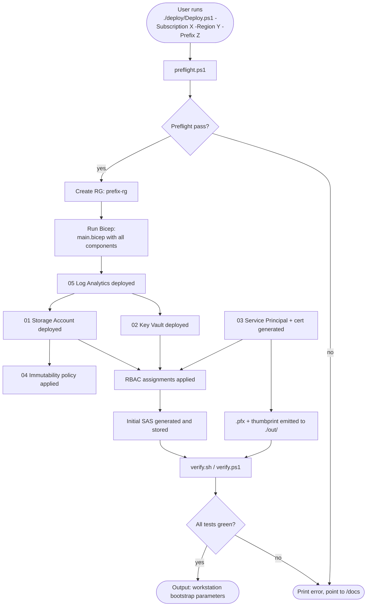

# Deployment Flow

What happens when a buyer clones this repo and runs the one-command deploy. Per CLAUDE.md Rule 9, this must be a single command from a clean Azure subscription.



## Preflight checks (deploy/preflight.ps1)

The preflight refuses to deploy unless every check passes:

1. Azure CLI installed (≥2.50.0)
2. Bicep installed (`az bicep version` ≥0.20.0)
3. Logged in to Azure (`az account show` returns)
4. Subscription ID matches the one passed in
5. The signed-in identity has Owner OR (Contributor + User Access Administrator) on the subscription — required for RBAC role assignments
6. Region is a valid Azure region in this subscription's allow-list
7. Prefix is 3–8 lowercase alphanumeric, no hyphens
8. Resource Group `<prefix>-rg` does not already exist (or exists empty — refuse if it has resources)
9. Storage Account name `<prefix>sa<unique4>` is globally available

If any check fails, the script exits non-zero and prints which check failed and how to fix it. No partial deploys.

## Bicep order of operations

The orchestrator `deploy/main.bicep` declares modules in dependency order:

```bicep
module la 'components/05-log-analytics/main.bicep' = {...}
module sa 'components/01-storage-account/main.bicep' = { dependsOn: [la] }
module imm 'components/04-immutability-policy/main.bicep' = { dependsOn: [sa] }
module kv 'components/02-key-vault/main.bicep' = { dependsOn: [la] }
module sp 'components/03-service-principal-auth/main.bicep' = {...}
module rbac_w 'components/03-service-principal-auth/rbac-write.bicep' = { dependsOn: [sp, sa] }
module rbac_kv 'components/03-service-principal-auth/rbac-kv.bicep' = { dependsOn: [sp, kv] }
module rbac_r 'components/06-rbac-consumer-access/main.bicep' = { dependsOn: [sa] }
```

Bicep parallelizes where it can. The `dependsOn` declarations are the only ordering constraints.

## Service Principal cert handling

The SP cert is generated at deploy time. Two options, with the deploy script choosing based on parameters:

1. **Self-signed cert generated by the deploy script.** Lifetime 90 days. Emitted to `./out/sp-cert-<timestamp>.pfx` with a randomly generated PFX password also emitted to `./out/sp-cert-<timestamp>.pfx.password.txt`. Operator must move both off the deploy host immediately and into a secure distribution channel. **Default mode.**
2. **External CA-signed cert.** Operator pre-generates a cert from their internal PKI, passes the public key to the deploy via `-CertPublicKey ./mycert.cer`. The private key never touches the deploy host. **Hardened mode for regulated deployers.**

ADR-003 (will be written in Stage 4) captures this trade-off.

## Verify (deploy/verify.ps1)

After deploy, the verify script runs the full test battery (Stage 3) against the live deployment. Output is structured: each test name → PASS/FAIL → diagnostic detail. Exit code is non-zero if any test fails.

## Teardown (deploy/teardown.ps1)

The teardown:

1. Removes RBAC assignments
2. Deletes the Service Principal
3. Issues `az group delete --name <prefix>-rg --yes`
4. Notes that the Key Vault and Storage Account are soft-deleted, not purged. Provides commands for purge if the user explicitly opts in.
5. **Refuses to teardown if the immutability policy has not yet expired.** This is a deliberate guardrail — the immutability policy is the contract with the user; tearing it down before retention expires defeats the design. Override flag exists for testing (`-ForceTearDownExpiredPolicy`) but must be passed explicitly.

## What success looks like

After `Deploy.ps1` exits 0, the operator has:

- A resource group with all six cloud-side components
- A `.pfx` cert + password for each lab workstation (or one shared cert, depending on parameter)
- A `workstation/config.json` template printed to stdout, ready to copy to each lab PC
- A clickable Azure portal URL pointing at the resource group
- A green test report

## Cross-Agent Review

- 🏗️ Architect: Signed.
- 🛡️ Security Engineer: The cert distribution problem (deploy host → lab PC) is the weakest link. Captured here as a known trade-off; ADR-003 will document the recommended distribution channel (in-person USB, signed email with separate password, or PKI cert).
- 🔧 Operator: The "preflight refuses, no partial deploy" rule is what I need. The teardown's refusal-to-purge default is also right.
- 📚 Documentarian: Signed.
