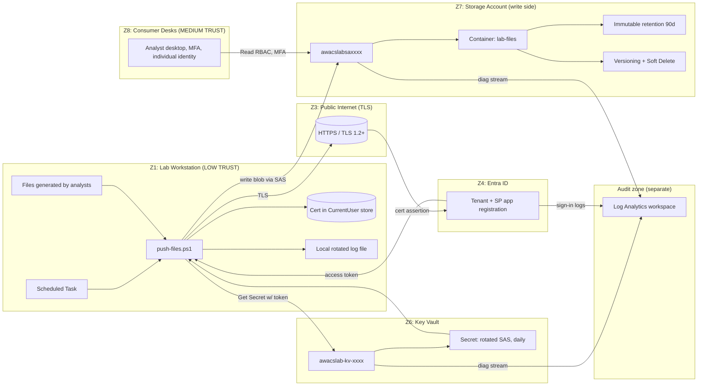

# System Diagram

System-level view of every long-lived component, the trust zones they live in, and the high-level data flow. For step-by-step interaction, see `data-flow.md`.

## What this diagram is saying

1. The lab PC has only what it needs to write: the cert, the script, and a local log.
2. The cert proves the lab PC's identity to Entra ID. Entra ID issues an access token.
3. The token unlocks one secret in Key Vault: today's SAS.
4. The SAS unlocks one container for writes only.
5. Once a file is in the container, immutability + versioning keep it durable.
6. Every step emits diagnostic data to a separate Log Analytics workspace — the lab PC cannot tamper with the audit trail because it has no role on the workspace.
7. Consumers (analysts at their desks) read from a different trust zone with a different identity. They never touch Z1.

## What this diagram is NOT showing

- The deployment-time control plane (separate diagram: `deployment-flow.md`)
- The detail of *which* RBAC roles are granted to which identity (separate diagram: `trust-boundaries.md`)
- The sequenced order of operations on a single push (separate diagram: `data-flow.md`)
