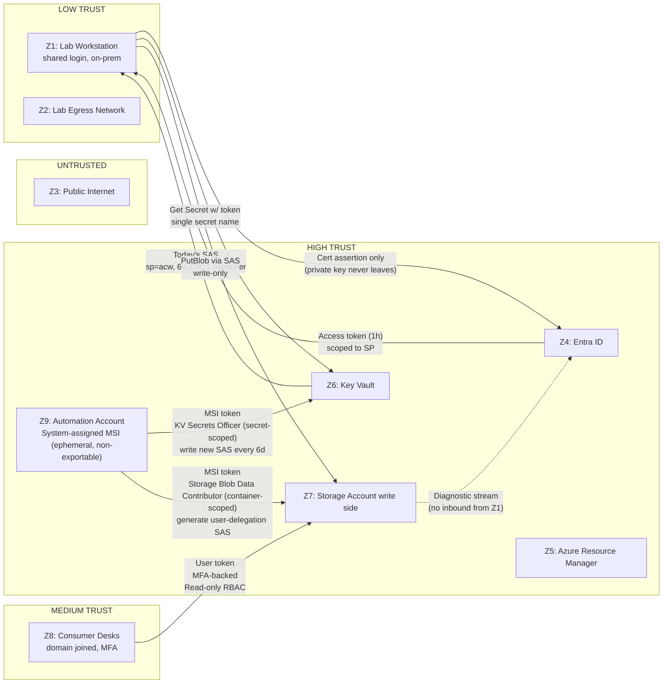

# Trust Boundaries

This diagram shows trust zones (Z1–Z9 from `threat-model.md` §2), the credentials that cross between them, and the scope of each credential.

## Credential inventory

Every credential in the system, by name, by scope, by lifetime, by where it lives.

| Credential | Lives in | Scope | Lifetime | Rotation | Defense if stolen |
|------------|----------|-------|----------|----------|-------------------|
| SP cert (.pfx) private key | `Cert:\CurrentUser\My` of lab service account | Authenticate as SP | 90 days | Manual or scripted before expiry | Write-only RBAC limits blast radius; revocable in Entra |
| SP access token | Process memory only, ≤1h | KV Get Secret + identity | 1 hour | Auto via Entra | Short window, revocable |
| Rotated SAS | Key Vault secret slot | Write-only on one container | 6d 23h | Every 6 days, automated (component 08) | 6d 23h window, write-only |
| Automation MSI token | Automation Account runtime (ephemeral) | KV Secrets Officer (secret-scoped) + Storage Blob Data Contributor (container-scoped) | Duration of runbook job (~30s) | Non-exportable; auto-issued per job | Non-exportable; token unusable outside Automation runtime |
| Consumer user token | Consumer's session | Read-only on container | per Entra session policy | per Entra | Read-only, audited |
| Storage account key | **Disabled.** Not used. | n/a | n/a | n/a | n/a |
| KV admin access policy | Operator Entra group, MFA-required | Manage KV | per session | per Entra | Out of band of the lab side |

The "Storage account key disabled" line is non-trivial. Per CIS 3.x and the threat model, account keys are a kill-switch for this whole design — anyone with the account key can do anything. We disable shared key auth on the storage account (`allowSharedKeyAccess: false` in Bicep) and force AAD-or-SAS auth only. This is enforced in component 01's Bicep.

## What each crossing is allowed to do

- **Z1 → Z4 (cert auth):** Sign a JWT assertion with the cert private key. That's it. No password, no API key, no shared secret in flight.
- **Z4 → Z1 (token issued):** Bearer token with audience set to ARM/KV/Storage. Cannot be re-used outside its audience.
- **Z1 → Z6 (Get Secret):** Single secret name (`current-write-sas`). No List, no Set, no Delete.
- **Z6 → Z1 (SAS returned):** Bearer SAS string. The most stealable credential in the system. Mitigated by 24h expiry + write-only.
- **Z1 → Z7 (Put Blob):** Write a blob in one container. Cannot read, cannot delete, cannot list (with appropriate SAS flags).
- **Z8 → Z7 (Read):** Authenticated user, MFA, read-only RBAC. Audited.
- **Z9 → Z6 (Set Secret):** Automation MSI writes a new version of `current-write-sas` only. Cannot read other secrets, cannot delete, cannot modify vault config.
- **Z9 → Z7 (GetUserDelegationKey + generate SAS):** Automation MSI calls the storage data plane to generate a user-delegation SAS. The resulting SAS is immediately written to Z6 — MSI does not retain it.

## Trust crossings explicitly NOT allowed

- Z1 → Z5 (ARM control plane): the SP is **not** an Owner, Contributor, or any role on the resource group. It cannot modify infrastructure.
- Z1 → Z6 List: the SP can `Get` only the named secret, cannot list other secrets.
- Z1 → Z7 with account key: account key auth is disabled at the storage account.
- Z8 → Z7 write or delete: consumer RBAC is reader only.
- Z7 → Z1: there is no return channel. Storage does not call the lab PC.

## Cross-Agent Review

- 🛡️ Security Engineer: Signed. The "credential inventory" table is the spec the SP and KV components implement against.
- 🏗️ Architect: Signed. The crossings → component contracts mapping is unambiguous.
- 🔧 Operator: Signed. Every credential has a documented rotation procedure.
- 📚 Documentarian: Signed. The "explicitly NOT allowed" list is the kind of thing a future reader needs to find on first skim.
