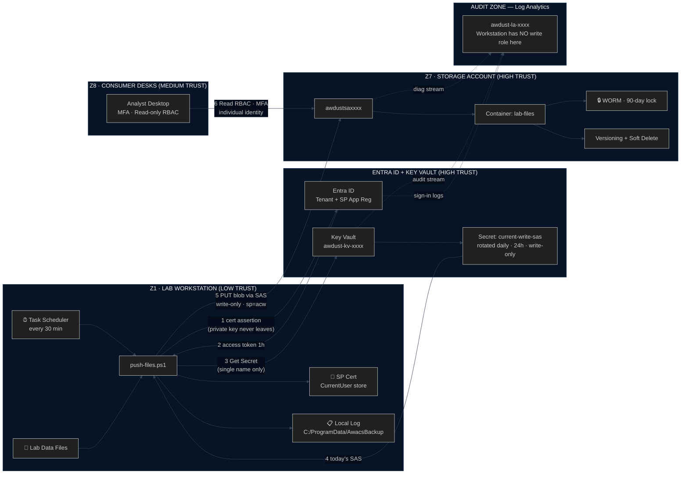
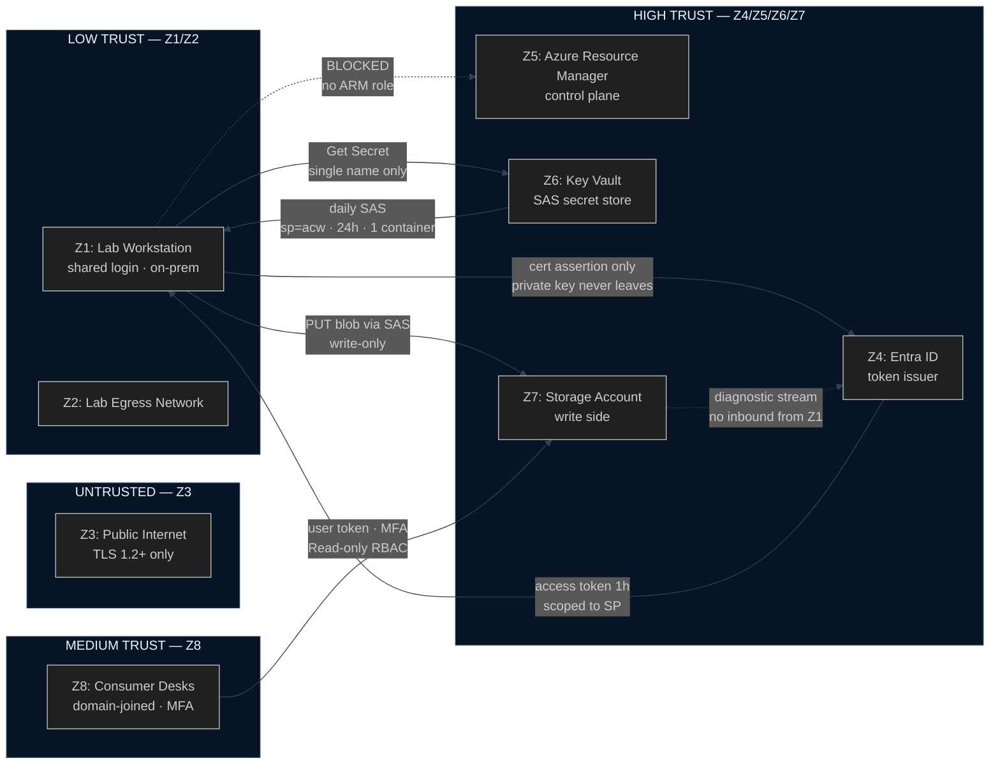
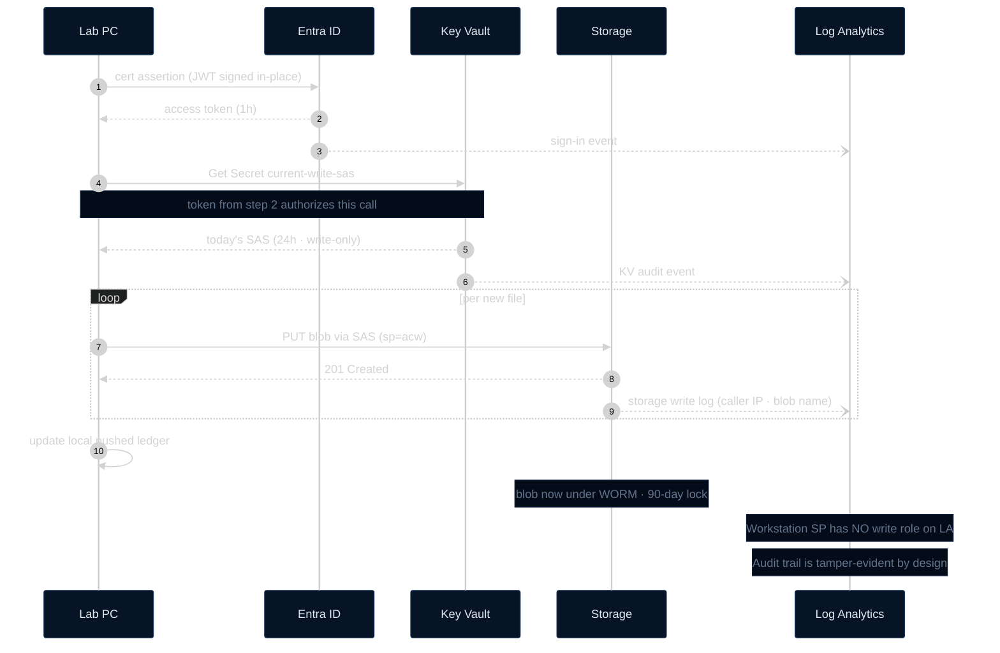
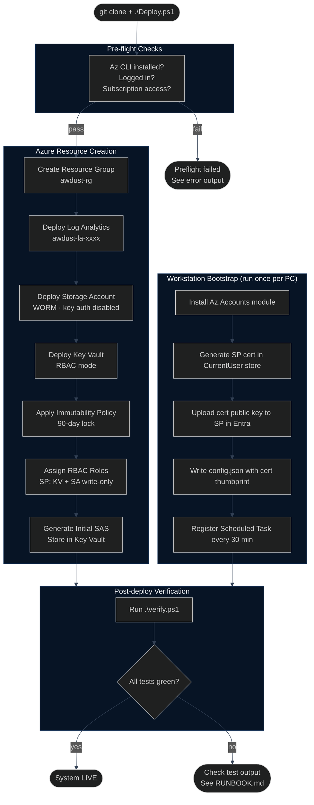

# Website Mermaid Diagrams

Drop any of these into a Mermaid-enabled site (GitHub Pages, Docusaurus, Obsidian, Notion, etc.) and they render with the custom dark theme below.

Each `%%{init}%%` block applies the AWACS dark palette. Copy the whole code block including that line.

---

## Diagram 1 — System Architecture (Full)



---

## Diagram 2 — Trust Boundaries



---

## Diagram 3 — Data Flow (Sequence)



---

## Diagram 4 — Deployment Flow



---

## Usage

**GitHub / GitHub Pages:** Mermaid renders natively in `.md` files on GitHub. Paste any block above as-is.

**Docusaurus / VitePress:** Requires `@docusaurus/theme-mermaid` or equivalent plugin. The `%%{init}%%` theme overrides work as-is.

**Export to PNG:** Install `@mermaid-js/mermaid-cli` then:

```
npx mmdc -i website-mermaid-diagrams.md -o diagram.png --theme dark --backgroundColor "#040c1a"
```

To export all four diagrams individually, extract each code block to its own `.mmd` file and run the command per file.
